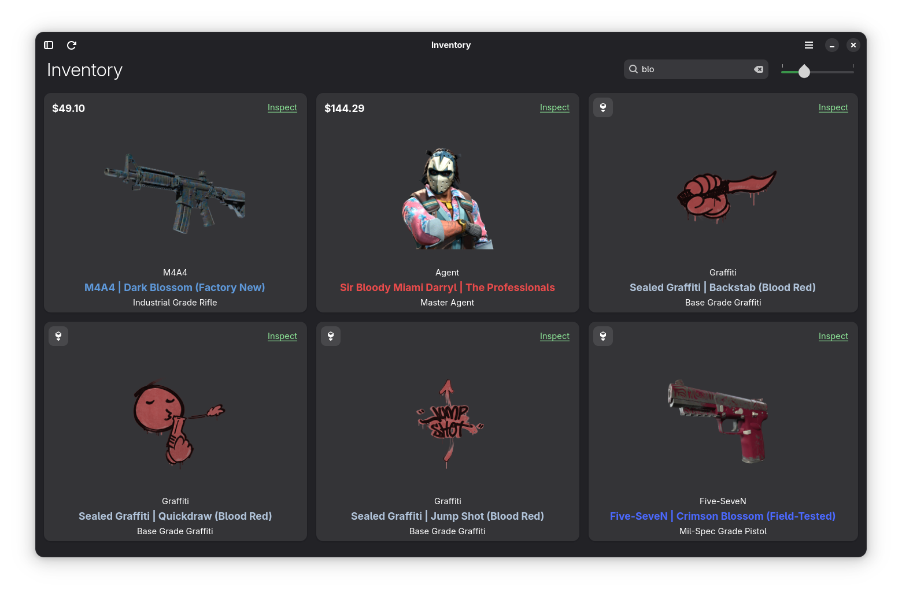
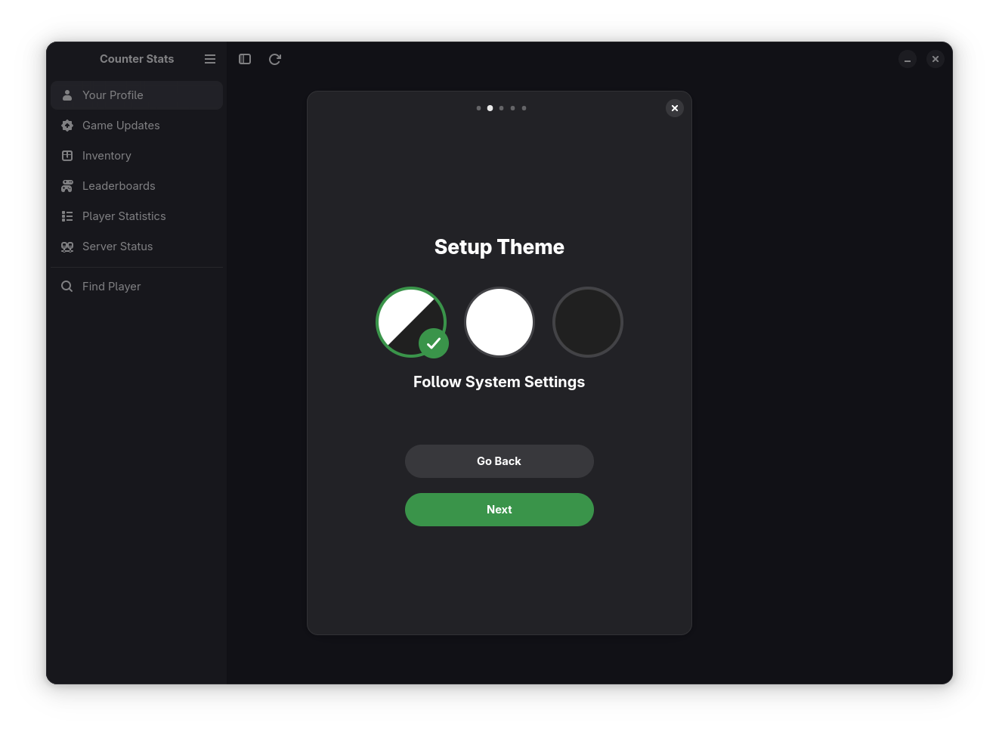
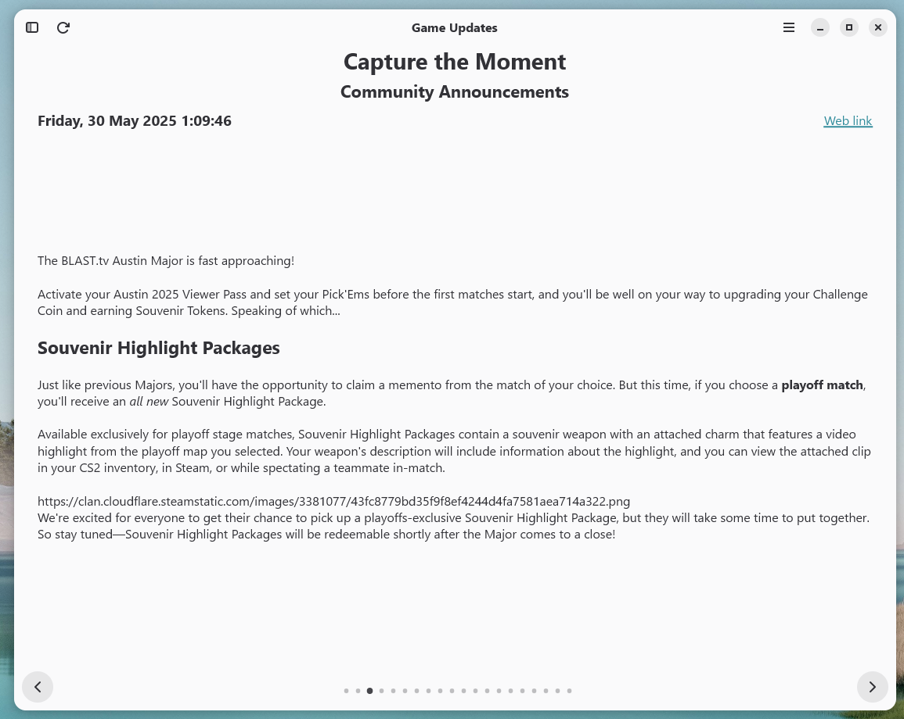

# **Counter Stats**


> Display Counter Strike 2 statistics, inventory, leaderboards and much more, all in one app!


## Gallery
|Profile|Server status|Inventory|
|--------------------|--------------------|--------------------|
|Preferences|Leaderboards|Initial setup Themepicker|
|Statistics (Windows)|Inventory (Windows)|Game Updates (Windows)|


## Build

### Linux

#### Running


To run this project, run the following commands:

```bash
dotnet run
```

#### Building

To build and install flatpak just run build_flatpak.sh:

```bash
./build_flatpak.sh
```

### Windows
Make sure to setup gtk and dotnet sdk first:

[Dotnet SDK](https://dotnet.microsoft.com/en-us/download)

[Gtk Install](https://www.gtk.org/docs/installations/windows/)

MSYS2 dependencies:

```bash
pacman -S mingw-w64-x86_64-gtk4 mingw-w64-x86_64-libadwaita mingw-w64-x86_64-blueprint-compiler mingw-w64-x86_64-librsvg 
```

#### Running

To run this project, run the following commands:

```bash
dotnet run
```

#### Building
To build and install flatpak just run build_windows.bat

>make sure "mingw_dir=" is set correctly (set by default to "C:\\msys64\\mingw64") in the script

Run: 

```bash
./build_windows.bat
```

## Built with:
[Gtk](https://www.gtk.org/)

[Adwaita](https://gnome.pages.gitlab.gnome.org/libadwaita/)

[Blueprints](https://gnome-team.pages.debian.net/blueprint-compiler/index.html)

[Dotnet](https://dotnet.microsoft.com/en-us/)