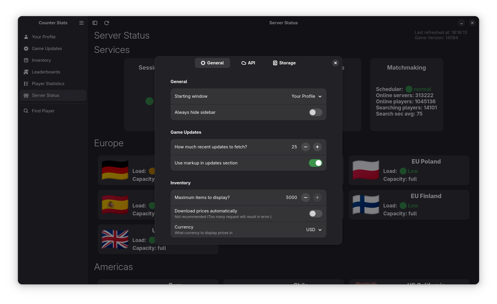

# **Counter Stats**


> Display Counter Strike 2 statistics, inventory, leaderboards and much more, all in one app!


## Gallery
||||
|--------------------|--------------------|--------------------|
||||
||||


## Build

### Linux
To run this project, run the following commands:

```bash
dotnet run
```

### Windows
Make sure to setup gtk and dotnet sdk first:

[Gtk Install](https://www.gtk.org/docs/installations/windows/)

[Dotnet SDK](https://dotnet.microsoft.com/en-us/download)

To run this project, run the following commands:

```bash
dotnet run
```

## Built with:
[Gtk](https://www.gtk.org/)

[Adwaita](https://gnome.pages.gitlab.gnome.org/libadwaita/)

[Blueprints](https://gnome-team.pages.debian.net/blueprint-compiler/index.html)

[Dotnet](https://dotnet.microsoft.com/en-us/)